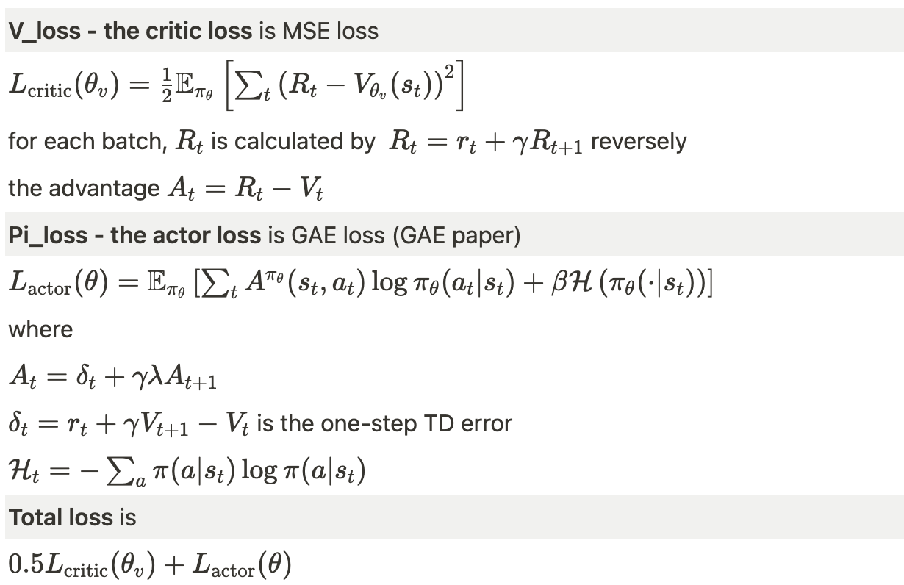

#### reference

https://github.com/ikostrikov/pytorch-a3c

#### environment

macOS M1

python 3.7.16 (conda env)

gym 0.26.2

torch 1.13.1

cv2 4.6.0

#### Atari env

**Pong-v0:** https://www.gymlibrary.dev/environments/atari/pong/

opponent: orange agent

player: green agent (RL agent)

reward: win +1, lose -1

termination: either one reaches 21 scores

#### execution and code diagram

python main.py --env-name 'Pong-v0' --num-processes 16

    pytorch_a3c_explanation/
    ├── main.py - execution
    ├── test.py - performance monitoring worker
    ├── train.py - local training for each worker
    ├── my_optim.py - Adam with shared memory
    ├── envs.py - image inputs resizing and normalization
    ├── model.py - actor-critic pytorch network model

#### network

      ActorCritic(
      (conv1): Conv2d(1, 32, kernel_size=(3, 3), stride=(2, 2), padding=(1, 1))
      (conv2): Conv2d(32, 32, kernel_size=(3, 3), stride=(2, 2), padding=(1, 1))
      (conv3): Conv2d(32, 32, kernel_size=(3, 3), stride=(2, 2), padding=(1, 1))
      (conv4): Conv2d(32, 32, kernel_size=(3, 3), stride=(2, 2), padding=(1, 1))
      (lstm): LSTMCell(288, 256)
      (critic_linear): Linear(in_features=256, out_features=1, bias=True)
      (actor_linear): Linear(in_features=256, out_features=6, bias=True)
      )

inputs: 3 channel image (1,42,42) from (210, 160, 3)

outputs: V, $\pi$ -logits, (hx,cx) (from LSTM)

initialization: Xavier (Glorot) Initialization + column normalization

#### updating

local gradients is updated and copied to shared model’s gradients every 20 steps

