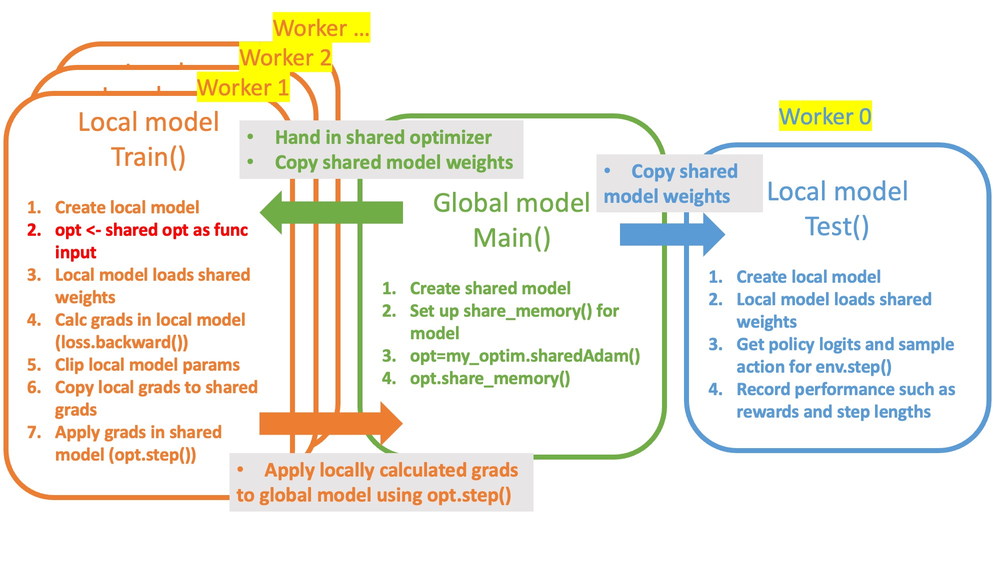

### reference

https://github.com/ikostrikov/pytorch-a3c

### environment

macOS Apple M1 (8 cpu cores)

python 3.7.16 (conda env)

gym 0.26.2 (pip install "gym[atari, accept-rom-license]”)

torch 1.13.1

cv2 4.6.0

### Atari env

**Pong-v0:** https://www.gymlibrary.dev/environments/atari/pong/

opponent: orange agent

player: green agent (RL agent)

reward: win +1, lose -1

termination: either one reaches 21 scores

**RL hyperparameters:**

lr 0.0001, gm 0.99, lambda(for gae) 1.0, beta(for entropy) 0.01, V_loss coef 0.5

### execution and code diagram

python main.py --env-name 'Pong-v0' --num-processes 16

**note:** mp.set_start_method('spawn') should be in the main script for running multiprocessing in macOS

    pytorch_a3c_explanation/
    ├── main.py - execution for pytorch multiprocessing
    ├── test.py - performance monitoring worker
    ├── train.py - local training for each worker
    ├── my_optim.py - customized Adam with shared memory
    ├── envs.py - image inputs resizing and normalization
    ├── model.py - actor-critic pytorch network model


### network


      ActorCritic(
      (conv1): Conv2d(1, 32, kernel_size=(3, 3), stride=(2, 2), padding=(1, 1))
      (conv2): Conv2d(32, 32, kernel_size=(3, 3), stride=(2, 2), padding=(1, 1))
      (conv3): Conv2d(32, 32, kernel_size=(3, 3), stride=(2, 2), padding=(1, 1))
      (conv4): Conv2d(32, 32, kernel_size=(3, 3), stride=(2, 2), padding=(1, 1))
      (lstm): LSTMCell(288, 256)
      (critic_linear): Linear(in_features=256, out_features=1, bias=True)
      (actor_linear): Linear(in_features=256, out_features=6, bias=True)
      )


**inputs:** 3 channel image (1,42,42) from (210, 160, 3)

**outputs:** V, $\pi$ -logits, (hx,cx) (from LSTM)

**initialization:** Xavier (Glorot) Initialization + column normalization

### updating



local gradients are updated and copied to the shared model’s gradients every 20 steps or when episode ends


### video recording

pip install --upgrade gym ale-py imageio imageio-ffmpeg

```python
#in envs.py
env = gym.make(env_id,render_mode='rgb_array')
#in test.py
env = gym.wrappers.RecordVideo(env, video_folder='videos', episode_trigger=episode_trigger)

def episode_trigger(episode_id):
    #return True  # Record every episode
    return episode_id % 100 == 0 # Record every 100 episode
    #return episode_id in [5, 15] # Record at 5 and 15 episode
```

### env notes

```python
state, info = env.reset()
#five outputs
state, reward, terminated, truncated, info = self.env.step(action)
```

### results
